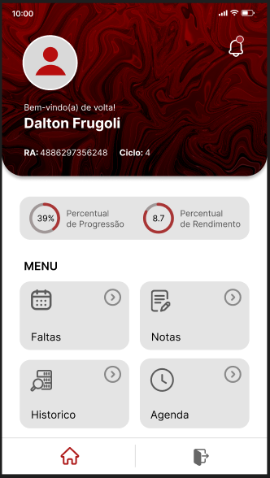
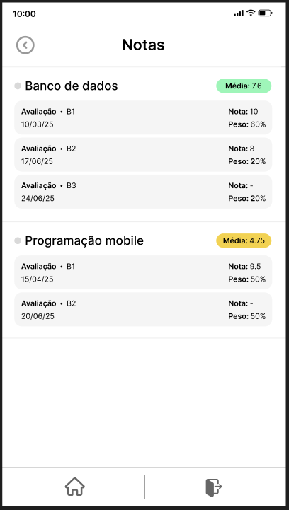

<div align="center">

# 📱 siFatec App

### Sistema de Gestão Acadêmica Mobile

Aplicativo mobile desenvolvido em **React Native** para auxiliar na gestão acadêmica de alunos, professores e administradores.

[](https://reactnative.dev/)
[](https://developer.mozilla.org/pt-BR/docs/Web/JavaScript)
[](https://www.typescriptlang.org/)
[](https://www.sqlite.org/)

[🔗 Repositório API Backend](https://github.com/daltonfrugoli/siFatec-API).

</div>

---

## 📸 Preview do Aplicativo

<div align="center">
  <table>
    <tr>
      <td align="center">
        
        <br />
        <sub><b>🔐 Tela de Login</b></sub>
      </td>
      <td align="center">
        
        <br />
        <sub><b>🏠 Dashboard</b></sub>
      </td>
      <td align="center">
        
        <br />
        <sub><b>📊 Notas e Faltas</b></sub>
      </td>
    </tr>
  </table>
</div>

---

## ✨ Funcionalidades

- 🔒 **Autenticação segura** - Login e gestão de sessão de usuários
- 📚 **Visualização de disciplinas** - Acompanhe suas matérias e horários
- 📊 **Consulta de notas e faltas** - Monitore seu desempenho acadêmico
- 🔔 **Notificações em tempo real** - Receba atualizações importantes
- 📱 **Interface responsiva** - Design amigável e intuitivo

---

## 🛠️ Tecnologias

Este projeto foi desenvolvido com as seguintes tecnologias:

| Tecnologia | Descrição |
|------------|-----------|
| **React Native** | Framework para desenvolvimento mobile multiplataforma |
| **JavaScript/TypeScript** | Linguagens de programação principal |
| **API Sauce** | Cliente HTTP para consumo de APIs |
| **React Navigation** | Biblioteca de navegação entre telas |
| **SQLite** | Banco de dados local para armazenamento offline |

---

## 📡 Integração com Backend

Este aplicativo consome os serviços fornecidos pela API desenvolvida em **Python** com **FastAPI**, garantindo:

- ⚡ **Alta performance** nas requisições
- 🔐 **Segurança** na comunicação de dados
- 📦 **Integração rápida** e confiável

**Repositório da API:** [siFatec-API](https://github.com/daltonfrugoli/siFatec-API)

---

## 🚀 Como executar o projeto

### Pré-requisitos

Antes de começar, você precisará ter instalado em sua máquina:
- [Node.js](https://nodejs.org/)
- [React Native CLI](https://reactnative.dev/docs/environment-setup)
- [Android Studio](https://developer.android.com/studio) ou [Xcode](https://developer.apple.com/xcode/) (para iOS)

### Instalação

```bash
# Clone este repositório
git clone https://github.com/daltonfrugoli/siFatec-App.git

# Acesse a pasta do projeto
cd siFatec-App

# Instale as dependências
npm install
# ou
yarn install

# Execute o aplicativo
npx react-native run-android
# ou
npx react-native run-ios
```

---

## 🎯 Roadmap

Funcionalidades planejadas para as próximas versões:

- [ ] 📴 Modo offline com sincronização automática
- [ ] 🏢 Suporte a múltiplas instituições de ensino
- [ ] 👨‍💼 Painel administrativo integrado no app
- [ ] 📈 Dashboard com estatísticas e gráficos
- [ ] 💬 Sistema de mensagens entre alunos e professores

---

## 👤 Autor

**Dalton Frugoli**

- GitHub: [@daltonfrugoli](https://github.com/daltonfrugoli)
- LinkedIn: [Dalton Frugoli](http://www.linkedin.com/in/dalton-frugoli) <!-- Adicione seu link do LinkedIn aqui -->

---

<div align="center">
  
⭐ Se este projeto te ajudou, considere dar uma estrela!

Feito com ❤️ por [Dalton Frugoli](https://github.com/daltonfrugoli)

</div>
