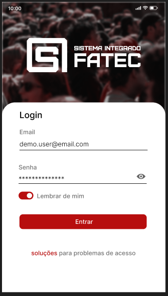

---

# 📱 App de Gestão Acadêmica

Aplicativo mobile desenvolvido em **React Native**, projetado para auxiliar na **gestão acadêmica** de alunos, professores e administradores. Este app consome os serviços fornecidos pela [API em FastAPI](https://github.com/daltonfrugoli/siFatec-API), garantindo integração rápida e segura.

---

### 🚀 Funcionalidades

* Autenticação e login de usuários
* Visualização de disciplinas e horários
* Consulta de notas e faltas do aluno
* Notificações em tempo real (quando integrado ao back-end)
* Interface amigável e responsiva

---

### 🛠️ Tecnologias utilizadas

* **React Native**
* **JavaScript / TypeScript**
* **API sauce**
* **React Navigation** (navegação entre telas)
* **SQLite**

---

### 📡 Integração com a API

Este app se conecta à API desenvolvida em Python com FastAPI:
👉 [Repositório da API](https://github.com/daltonfrugoli/siFatec-API)

---

### 📸 Screenshots (opcional)

  
  
  

---

### 📌 Futuras melhorias

* Modo offline com sincronização
* Suporte a múltiplas instituições
* Painel administrativo no app

---
